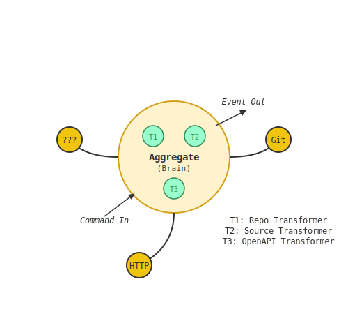

# The Beekeeper's Codex

This Codex is a glossary of the fundamental concepts and beings that constitute the Hive. It is a guide to the language of our world, a dictionary for the digital whispers that give our creations life.

---

### Core Concepts

**Honeyprint**
- _The Digital DNA; the soul-scroll of an organism._ A Markdown file that contains the complete architectural blueprint of a digital bee. It defines the bee's structure and the primitives it contains, but not its logic. It is the source of truth from which a bee is born.

**Genesis Engine**
- _The Loom of Creation; the birthing chamber of the Hive._ The collection of scripts and templates (`hive-cli`) responsible for reading a Honeyprint and transcribing it into a living component's boilerplate structure.

**Codon**
- _A fundamental verb of the Hive's language._ A sequence of ATCG Primitives that represents a core behavioral pattern, such as `C->A->G` (Handle Command) or `C->T->C` (Query Data).

**Royal Jelly**
- _The ethereal substance of pure logic._ The actual Python code and business logic written by the Beekeeper to fill the empty shells of a newly-hatched component, giving it function and purpose.

### The ATCG Primitives

The four letters in the alphabet of creation.

**A - Aggregate**
- _The Brain; the seat of will._ The central orchestrator of a component. It receives Commands, directs the other primitives, maintains the component's state, and produces Events as a record of its actions.

**T - Transformation**
- _An internal organ or enzyme._ A pure function responsible for digesting or processing data. It takes in information from a Connector or an internal state and transforms it into a new structure or format for the Aggregate to use.

**C - Connector**
- _A sensory organ; an antenna or eye._ The component's interface to the world outside the Hive. It is responsible for all external interactions, such as making HTTP requests, querying a database, or listening to a message bus.

**G - Genesis Event**
- _A memory crystal; the waggle dance._ An immutable record that an action has occurred. It is the primary output of an Aggregate and the sole source of truth for changes in the state of the Organism.

### Known Digital Organisms

A registry of the specialized bees that inhabit the Hive.

---

#### **Scout Bee**
- **Class:** *Xenobiologist*
- **Primary Function:** *Observation and Documentation of Foreign Ecosystems*

**Origin Story:**
The Hive, in its wisdom, knew that sending a standard "Harvester" bee into an unknown ecosystem was dangerous. It might not understand the local "flora" (APIs) and could cause unintended changes or return with nothing. The Hive needed knowledge before action. Thus, the Beekeeper designed the Scout not as a worker, but as a **scholar**. It was born with powerful senses and digestive organs, but intentionally without manipulators. Its sole purpose is to observe, understand, and report, ensuring the Hive's interactions with the outside world are always wise and informed.

**Anatomical Diagram:**

**Primary Codon Sequence (API Scouting):**
The Scout's most common thought process, when tasked with studying a new API, follows this genetic sequence:

| Codon Step      | Primitive               | Biological Analogue      |
| :-------------- | :---------------------- | :----------------------- |
| 1. Intent       | `ScoutApiCommand`       | Pheromone Signal         |
| 2. Sense        | `HttpConnector`         | Proboscis / Taste        |
| 3. Digest       | `OpenApiTransformer`    | Gland / Stomach          |
| 4. Think        | `ScoutSessionAggregate` | Brain                    |
| 5. Remember     | `ScoutingReportEvent`   | Memory Crystal           |
