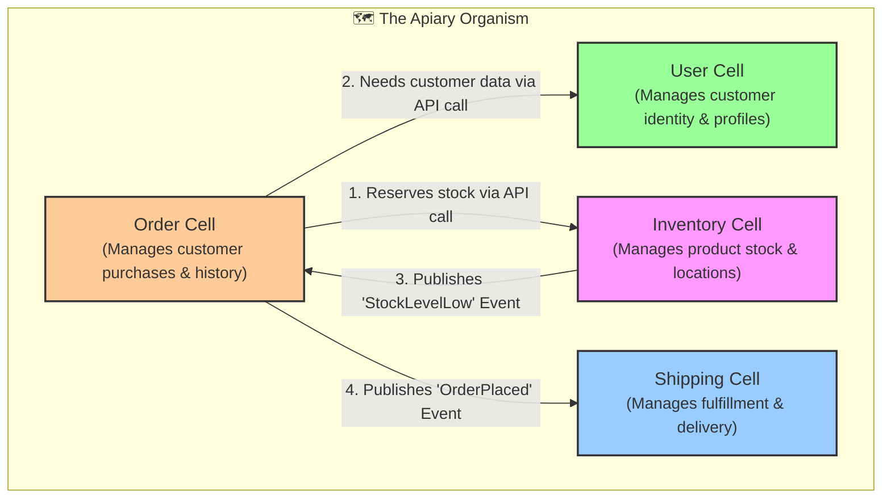

# The Hive Constitution

This document outlines the "Will of the Hive"—the fundamental principles and architecture that guide our ecosystem. It is the highest law of our software land.

## Core Principles (The Laws of Cellular Architecture)

1.  **The System is an Organism, a Service is a Cell.** Our system is an organism composed of independent but cooperating cells. Each microservice or Bounded Context is a "Cell".
2.  **The Cell Wall is Sacred.** Each Cell has a strong, explicit boundary (its API). Communication between Cells *only* happens through this boundary. There is no direct access to another Cell's internal state or data.
3.  **A Cell Owns Its Data.** Each Cell is the single source of truth for the data it manages. There are no shared databases between Cells. To get data from another Cell, you must ask its public API.
4.  **The Duality Principle (A-T, G-C Pairing).** The system is built on complementary pairs. A `Command` is paired with an `Event`. A `Request` is paired with a `Response`. This ensures a self-validating and auditable system.
5.  **The Physics of Code (Position & Orientation).** The behavior of code is determined by both its **sequence** (the order of operations) and its **context** (the runtime environment, transactions, etc.). Both must be considered in design.
6.  **One DNA, Many Expressions.** All Cells are built from the same four `ATCG` primitives defined in our `dna-core`. The implementation language (`py`, `go`) is an expression of this shared DNA.
7.  **Design for Resilience.** Each Cell must be able to function (or gracefully degrade) if a Cell it depends on is unavailable. We build for failure.

## The Apiary Map (Version 1.0)

This map shows the primary Cells (Bounded Contexts) in our organism and their relationships.

