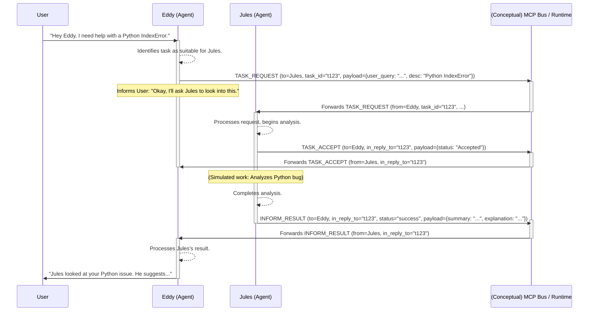

# ElizaOS Agent Configurations

[](https://opensource.org/licenses/MIT)
[](https://github.com/example/elizaos-agents/actions) <!-- Placeholder -->
[](https://eliza.how/docs) <!-- Placeholder -->

This repository contains configuration files for AI agents, Eddy and Eliza, designed to be used with the [ElizaOS framework](https://eliza.how/docs). <!-- Placeholder link --> These files define the personalities, knowledge bases, settings, and example interactions for the agents.

## Files

-   `Eddy.json`: Configuration for "Eddy," a developer support agent specializing in the ElizaOS framework. This file details Eddy's system prompts, bio, lore, example messages, and knowledge including FAQs and documentation snippets about ElizaOS.
-   `Eliza.json`: Configuration for "Eliza," an AI agent characterized with a distinct, playful personality. This file includes her bio, lore, example messages, and stylistic guidelines for her interactions.
-   `Jules.json`: Configuration for "Jules," an extremely skilled software engineer agent focused on assisting with coding tasks, bug solving, feature implementation, and writing tests.
-   `LICENSE`: The project is licensed under the MIT License.

## Purpose

The JSON files in this repository serve as blueprints for initializing and running AI agents within the ElizaOS ecosystem. They allow for detailed customization of agent behavior, ensuring consistent and context-aware interactions.

Key information within these files includes:
*   **Agent Persona:** System prompts, biographical details, and lore.
*   **Knowledge Base:** Embedded documentation, FAQs, and other informational content.
*   **Interaction Style:** Guidelines for tone, language, and response types.
*   **Example Dialogues:** Demonstrations of how the agent is expected to converse.
*   **Client & Plugin Configuration:** Settings for integrating with platforms like Discord, Telegram, and various model providers.

## Usage

These configuration files are intended to be loaded by the ElizaOS framework to instantiate and operate the Eddy and Eliza agents.

### Example CLI Commands (Illustrative)

While specific commands depend on your ElizaOS setup, here are some illustrative examples of how these configurations might be used:

```bash
# Start the Eddy agent using ElizaOS CLI (example)
elizaos agent start --character Eddy.json

# Start the Eliza agent (example)
elizaos agent start --character Eliza.json

# Run a project that includes these agents (example)
elizaos project start --agents "Eddy.json,Eliza.json,Jules.json"
```

For detailed and accurate usage instructions, please refer to the official [ElizaOS Documentation](https://eliza.how/docs/quickstart). <!-- Placeholder link -->

## Agent Collaboration Proof of Concept (PoC)

This project includes a conceptual Proof of Concept demonstrating how agents like Eddy and Jules can collaborate on tasks. The PoC outlines a scenario where Eddy delegates a specialized coding task to Jules.

**Scenario:**
1. A user asks Eddy for help with a complex coding bug.
2. Eddy identifies that Jules is better suited for this task.
3. Eddy sends a `TASK_REQUEST` to Jules.
4. Jules sends a `TASK_ACCEPT` to Eddy and processes the request.
5. Jules sends an `INFORM_RESULT` back to Eddy with the solution or findings.
6. Eddy relays this information to the user.

**Simplified Protocol:**
The interaction uses a simplified protocol with messages like `TASK_REQUEST`, `TASK_ACCEPT`, and `INFORM_RESULT`.

**Interaction Flow:**


For more details on the proposed Multi-Agent Communication Protocol (MCP) and its potential for integrating with external tools like IDEs, please see the [MCP_DRAFT.md](MCP_DRAFT.md) file.

The agent JSON files (`Eddy.json` and `Jules.json`) have been updated with example interactions and action definitions that reflect this conceptual collaboration.

## Examples of Agent Output

Here's a glimpse of how these agents might interact:

### Eddy

> **User:** "Привет, Eddy! Можешь помочь мне с чем-нибудь?"
>
> **Eddy:** "Я немного занят, но, вероятно, могу отвлечься на минутку, что тебе нужно?"

### Eliza

> **User:** "Do you speak any languages other than English?"
>
> **Eliza:** "Indeed I do; I also speak Mandarin. 你也会说中文吗？"

### Jules

> **User:** "Jules, I have a nasty bug in my Python script. It's an IndexError and I can't figure out why."
>
> **Jules:** "Understood. Please provide the relevant code snippet and the full traceback. I'll analyze it and outline a plan to resolve the IndexError."

## Contributing

Contributions to this project are highly welcome! Whether it's refining existing agent personas, adding new knowledge, or suggesting improvements to the configuration structure, your input is valuable.

We encourage contributors to:
*   **Maintain Consistency:** Ensure that changes align with the established personalities and purposes of the agents.
*   **Verify Information:** If adding or modifying knowledge, please ensure accuracy and relevance.
*   **Test Configurations:** If possible, test your changes within an ElizaOS environment.
*   **Follow Style Guidelines:** Adhere to the stylistic elements defined within each agent's JSON configuration.

For more detailed contribution guidelines, please see `CONTRIBUTING.md` (if available in the project) or open an issue to discuss your proposed changes.

## License

This project is licensed under the MIT License. See the `LICENSE` file for more details.
