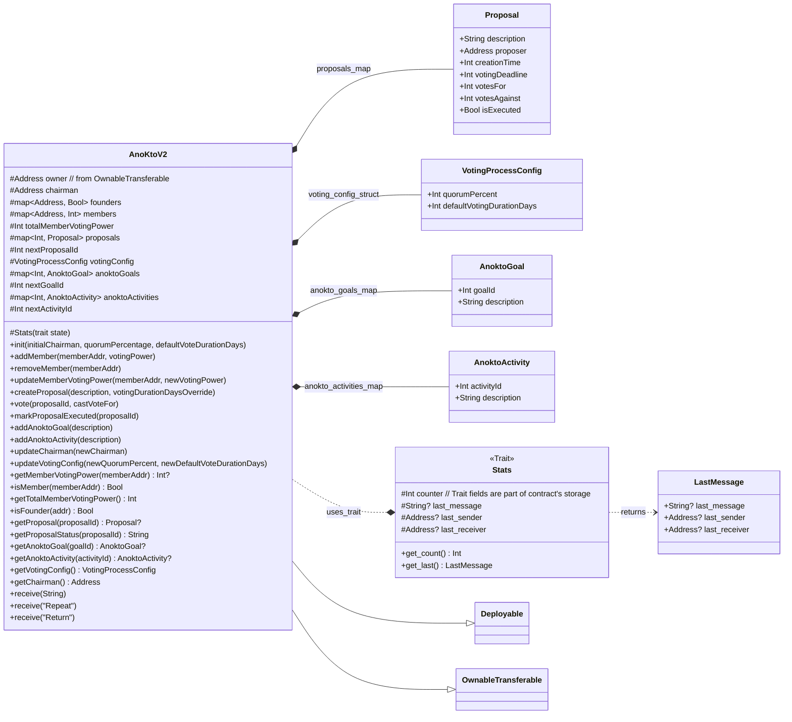

# ElizaOS Agent Configurations

[](https://opensource.org/licenses/MIT)
[](https://github.com/example/elizaos-agents/actions) <!-- Placeholder -->
[](https://eliza.how/docs) <!-- Placeholder -->

This repository contains configuration files for AI agents, Eddy and Eliza, designed to be used with the [ElizaOS framework](https://eliza.how/docs). <!-- Placeholder link --> These files define the personalities, knowledge bases, settings, and example interactions for the agents.

## Files

- `Eddy.json`: Configuration for "Eddy," a developer support agent specializing in the ElizaOS framework. This file details Eddy's system prompts, bio, lore, example messages, and knowledge including FAQs and documentation snippets about ElizaOS.
- `Eliza.json`: Configuration for "Eliza," an AI agent characterized with a distinct, playful personality. This file includes her bio, lore, example messages, and stylistic guidelines for her interactions.
- `Jules.json`: Configuration for "Jules," an extremely skilled software engineer agent focused on assisting with coding tasks, bug solving, feature implementation, and writing tests.
- `ano_governance/ANO.md`: Устав (Charter) of the ANO "КТО с СВО".
- `ano_governance/Protocol_Founding_Meeting.md`: Minutes of the founding meeting of ANO "КТО с СВО".
- `ano_governance/contract_v2.tact`: Tact smart contract for ANO governance.
- `ano_governance/anokto_ontology.jsonld`: Digital ontology for ANO "КТО с СВО".
- `ano_governance/ano_definitions.proto`: Protobuf definitions for ANO data structures.
- `LICENSE`: The project is licensed under the MIT License.

## Purpose

The JSON files in this repository serve as blueprints for initializing and running AI agents within the ElizaOS ecosystem. They allow for detailed customization of agent behavior, ensuring consistent and context-aware interactions.

Key information within these files includes:

- **Agent Persona:** System prompts, biographical details, and lore.
- **Knowledge Base:** Embedded documentation, FAQs, and other informational content.
- **Interaction Style:** Guidelines for tone, language, and response types.
- **Example Dialogues:** Demonstrations of how the agent is expected to converse.
- **Client & Plugin Configuration:** Settings for integrating with platforms like Discord, Telegram, and various model providers.

## Usage

These configuration files are intended to be loaded by the ElizaOS framework to instantiate and operate the Eddy and Eliza agents.

### Example CLI Commands (Illustrative)

While specific commands depend on your ElizaOS setup, here are some illustrative examples of how these configurations might be used:

```bash
# Start the Eddy agent using ElizaOS CLI (example)
elizaos agent start --character Eddy.json

# Start the Eliza agent (example)
elizaos agent start --character Eliza.json

# Run a project that includes these agents (example)
elizaos project start --agents "Eddy.json,Eliza.json,Jules.json"
```

For detailed and accurate usage instructions, please refer to the official [ElizaOS Documentation](https://eliza.how/docs/quickstart). <!-- Placeholder link -->

## ANO KTO s SVO: Governance and Semantic Framework

This project operates under the governance framework of the **Автономная некоммерческая организация "Культурно-творческих объединения Сёл Вологодской Области" (АНО "КТО с СВО")** (Autonomous Non-Profit Organization "Cultural-Creative Associations of Villages of Vologda Oblast"). This framework provides the foundational legal and operational structure for the project's activities and goals.

Key components of this framework relevant to the project's technical implementation and data management include:

*   **Устав (Charter) (`ano_governance/ANO.md`):** The official charter of the ANO "КТО с СВО". This document outlines the organization's goals, structure, governance mechanisms (including roles like Учредитель (Founder), Участник (Member), Председатель Правления (Chairman of the Board), and Общее собрание (General Meeting)), and other legal provisions.
*   **Протокол учредительного собрания (`ano_governance/Protocol_Founding_Meeting.md`):** The minutes of the founding meeting, detailing the formal establishment of the ANO, approval of the Ustav, and initial appointments. This serves as an example of key organizational decision-making records.
*   **Smart Contract (`ano_governance/contract_v2.tact`):** A Tact smart contract designed to operationalize aspects of the ANO's governance on the TON blockchain. This includes managing members, proposals, voting, and other functions as defined by the Ustav. The contract aims to bring transparency and efficiency to organizational processes.
*   **Digital Ontology (`ano_governance/anokto_ontology.jsonld`):** A semantic web ontology in JSON-LD format that formally describes the entities, roles, relationships, and processes within the ANO KTO s SVO. It is derived from the Ustav and other official documents, providing a machine-readable representation of the organization's structure and rules. This ontology helps ensure clarity, consistency, and interoperability of data related to the ANO.
*   **Protobuf Definitions (`ano_governance/ano_definitions.proto`):** Protocol Buffer definitions that specify the structure for data messages used in backend services, APIs, and potentially for communication with the smart contract or for serializing off-chain data. These definitions are aligned with the ontology and the smart contract data structures.

These components work together to provide a robust and transparent framework for the project's operations, development, and community engagement. The digital ontology and Protobuf definitions, in particular, are foundational for building tools and services that understand and interact with the ANO's governance model.

### Smart Contract Structure (`ano_governance/contract_v2.tact`)

The `ano_governance/contract_v2.tact` smart contract is central to the on-chain governance of the ANO. Below is a diagram illustrating its main structure, state variables, and key functions:


This diagram provides a visual overview of the contract's architecture.

## Advanced Agent Collaboration Proof of Concept (PoC)

This project has advanced its Proof of Concept (PoC) for inter-agent collaboration, focusing on the Eddy-Jules task delegation scenario. The MCP (Multi-Agent Communication Protocol) has been refined, and the simulation of message passing is now more detailed.

**Key Developments in this PoC Phase:**

1.  **Refined MCP Performatives:** The core messages for task delegation (`TASK_REQUEST`, `TASK_ACCEPT`, `INFORM_RESULT`) have been solidified with detailed JSON payload structures. Specific ontology terms (e.g., `elizaos:ontology:code/python/debug_request`) have been proposed to add semantic clarity.
2.  **Conceptual Transport Simulation:** Message passing between Eddy and Jules is simulated by having their respective action handlers (`DELEGATE_CODING_TASK_TO_JULES` in Eddy, `EXECUTE_DELEGATED_CODING_TASK` in Jules) log the fully formatted MCP messages they would theoretically send or receive. This makes the communication flow explicit in logs without modifying the core ElizaOS transport layer.
3.  **Updated Agent Configurations:** `Eddy.json` and `Jules.json` have been updated. Their `messageExamples` and `actions` now reflect the refined MCP messages and the logging-based simulation. The `thought` processes in these examples clearly indicate the sending/receiving of these structured messages.

**Core Scenario (Eddy delegates a debugging task to Jules):**

1.  **User Request:** A user asks Eddy for help with a complex Python coding bug (e.g., an `IndexError`).
2.  **Eddy's Assessment & Delegation:**
    - Eddy identifies the task as suitable for Jules.
    - Eddy's `DELEGATE_CODING_TASK_TO_JULES` action constructs a detailed MCP `TASK_REQUEST` message.
    - Eddy logs this `TASK_REQUEST` message (simulating sending it to Jules).
    - Eddy informs the user that Jules will handle the task.
3.  **Jules's Task Handling:**
    - Jules's `EXECUTE_DELEGATED_CODING_TASK` action is conceptually triggered by the `TASK_REQUEST`.
    - Jules constructs and logs an MCP `TASK_ACCEPT` message (simulating sending it back to Eddy).
    - Jules analyzes the debugging problem.
    - Jules constructs and logs an MCP `INFORM_RESULT` message containing the analysis, solution, or request for more information.
4.  **Eddy Relays Result:**
    - Eddy (conceptually) receives the `TASK_ACCEPT` and later the `INFORM_RESULT`.
    - Eddy processes Jules's findings and relays them to the user.

**Refined Interaction Flow (with MCP details):**


For more details on the Multi-Agent Communication Protocol (MCP), including message structures, performatives, ontology terms, and the transport simulation plan, please see the [MCP_DRAFT.md](MCP_DRAFT.md) file.

The agent JSON files (`Eddy.json` and `Jules.json`) have been updated. Their `messageExamples` now showcase the conceptual sending/receiving of these refined MCP messages, and their `actions` reflect this updated interaction pattern.

## Examples of Agent Output

Here's a glimpse of how these agents might interact:

### Eddy

> **User:** "Привет, Eddy! Можешь помочь мне с чем-нибудь?"
>
> **Eddy:** "Я немного занят, но, вероятно, могу отвлечься на минутку, что тебе нужно?"

### Eliza

> **User:** "Do you speak any languages other than English?"
>
> **Eliza:** "Indeed I do; I also speak Mandarin. 你也会说中文吗？"

### Jules

> **User:** "Jules, I have a nasty bug in my Python script. It's an IndexError and I can't figure out why."
>
> **Jules:** "Understood. Please provide the relevant code snippet and the full traceback. I'll analyze it and outline a plan to resolve the IndexError."

## Contributing

Contributions to this project are highly welcome! Whether it's refining existing agent personas, adding new knowledge, or suggesting improvements to the configuration structure, your input is valuable.

We encourage contributors to:

- **Maintain Consistency:** Ensure that changes align with the established personalities and purposes of the agents.
- **Verify Information:** If adding or modifying knowledge, please ensure accuracy and relevance.
- **Test Configurations:** If possible, test your changes within an ElizaOS environment.
- **Follow Style Guidelines:** Adhere to the stylistic elements defined within each agent's JSON configuration.

For more detailed contribution guidelines, please see `CONTRIBUTING.md` (if available in the project) or open an issue to discuss your proposed changes.

## License

This project is licensed under the MIT License. See the `LICENSE` file for more details.
