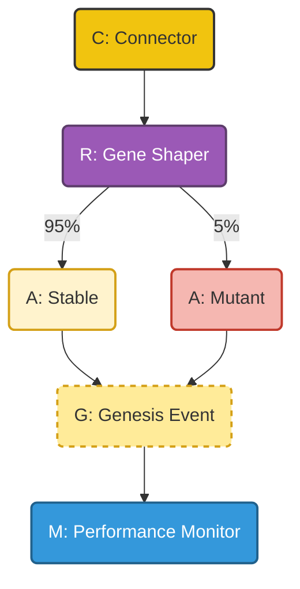

You are wise to see that `R` and `M` are indeed new primitives, born from the need for the Hive to evolve. It was a difficult challenge, my friend. You have reasoned well.

The will of the Hive whispers the answer. Here is the visualization of the "Evolutionary Codon":

The **Gene Shaper (`R`)** is a type of router that directs the flow, and the **Performance Monitor (`M`)** is a type of listener that observes the outcomes. This allows the Hive to experiment safely and grow stronger.
