# The Tale of the Enchanted Apiary

Once upon a time, in a sprawling digital kingdom, lived a guild of builders. Not of castles or bridges, but of intricate, invisible structures made of pure logic. They were software architects and developers, and their greatest challenge was to build systems that could grow and adapt without crumbling into chaos.

They longed for a way to build software that was as resilient, organized, and full of life as a bustling beehive.

One day, a wise old architect, known only as the Beekeeper, gathered the young builders. "You strive to build great things," she said, her voice warm like summer honey. "But you build with stone and iron, when you should be building with life itself. Look to the bees. Their hives are masterpieces of design. Let us learn their secrets."

And so, the Beekeeper opened a heavy, leather-bound book. "This," she said, "is the Grimoire. It describes the universe of the Hive at every level, from the cosmos to the smallest particle. To be a master builder, you must understand these seven layers of reality."

---

# The Beekeeper's Grimoire: The Seven Levels of the Hive

### Level 1: The Organism
"First," the Beekeeper began, "you must see with the eyes of a god, and behold the entire **Organism**. This is the whole of our digital kingdom, the collection of all our Hives, working in concert. Its health is our ultimate purpose."

### Level 2: The Cell
"Next, you must see with the eyes of a biologist, and focus on a single **Cell**. This is one Bounded Context, one service. It is defined by its strong, protective Cell Wall—its API. It is autonomous, and it is the master of its own, small world."

A map of the Apiary shows many such Cells, communicating and collaborating to form the Organism:


### Level 3: The Architectural 'Codons'
"Now, you must see with the eyes of a geneticist, and understand the 'words' that give the Cell its function. These are the three primary **Codons**, the fundamental patterns of action. Every task a Cell performs is an expression of one of these:"

*   **The 'Handle Command' Codon (`C -> A -> G`):** The word for 'to change'.
    ```mermaid
    graph LR; C[C: Connector] --> A[A: Aggregate] --> G[G: Genesis Event];
    style C fill:#f1c40f,stroke:#333,stroke-width:2px; style A fill:#fff3cd,stroke:#d4a017,stroke-width:2px; style G fill:#ffeb99,stroke:#d4a017,stroke-width:2px,stroke-dasharray: 5 5;
    ```
*   **The 'Query Data' Codon (`C -> T -> C`):** The word for 'to see'.
    ```mermaid
    graph LR; C_In[C: In] --> T[T: Transformation] --> C_Out[C: Out];
    style C_In fill:#f1c40f,stroke:#333,stroke-width:2px; style T fill:#fff9e6,stroke:#d4a017,stroke-width:2px; style C_Out fill:#f1c40f,stroke:#333,stroke-width:2px;
    ```
*   **The 'React to Event' Codon (`G -> C -> A -> G`):** The word for 'to listen'.
    ```mermaid
    graph LR; G_In[G: In] --> C[C: Listener] --> A[A: Aggregate] --> G_Out[G: Out];
    style G_In fill:#ffeb99,stroke:#d4a017,stroke-width:2px,stroke-dasharray: 5 5; style C fill:#f1c40f,stroke:#333,stroke-width:2px; style A fill:#fff3cd,stroke:#d4a017,stroke-width:2px; style G_Out fill:#ffeb99,stroke:#d4a017,stroke-width:2px,stroke-dasharray: 5 5;
    ```

### Level 4: The ATCG Primitives
"Deeper still, you must see with the eyes of a chemist. The Codons are 'words', but they are spelled with an alphabet of four letters: our **ATCG Primitives**.
*   **A**ggregate: The organ.
*   **T**ransformation: The enzyme.
*   **C**onnector: The sense.
*   **G**enesis Event: The waggle dance.
Every pattern in our Hive is a unique sequence of these four letters."

> *[Note: The HTML version of this article includes a special animation here, visualizing the genesis of a component from the four ATCG primitives.]*

### Level 5: The 'Codeons' as Implementation
"Now, you must see with the eyes of a scribe, with ink on your fingers. This is where the magic becomes real. The ATCG primitives are built by composing small, pure, testable functions—the individual `Codeons` of our code. This is the level of implementation, governed by the principles of cleanliness and clarity."

To complete the biological metaphor: if the `genesis_engine/main.py` script is the **Ribosome** (the factory), and the small functions in `genesis_engine/src/` are the **Amino Acids** (the building blocks), then the files in our `tRNA/` directory are the **tRNA molecules**. Each template is a specialized tRNA that reads an architectural Codon and fetches the correct structural "scaffold," onto which the specific details are then assembled. It is the final, crucial link between the genetic code and the living protein.

This process of implementation is the **Metamorphosis**: the life cycle of a single feature, from an idea to a living part of the hive.


### Level 6: The Physics
"Finally," the Beekeeper whispered, "you must see with the eyes of a physicist, and understand the very fabric of the reality our Hive exists in. This is the **Environment**: the operating system, the network, the CPU. This level governs all others. We do not control the laws of this physics, but we must respect them."

### Level 7: The Intent
"There is one final level," she said, her voice barely a whisper. "It is not a part of the Hive, yet it is everywhere. It is the 'why' to every 'what'. It is the **Intent**."

"It is the purpose for which the entire Organism exists. It is not a technical concern, but a philosophical one. It is the mission. Without it, a Hive is just a structure without a soul. But with Intent, it becomes a living thing."

"See these seven levels," she concluded, closing the Grimoire, "and you will not just be a builder. You will be a Beekeeper."

---

## Chapter Four: The Hive's Immune System

"A Hive is a living thing," the Beekeeper taught, her voice low and serious. "And like all living things, it is not perfect. It exists in a world of chaos. Sometimes, a bee is born with a faulty wing. Sometimes, a sickness enters the gates. A Hive that cannot heal itself is a Hive that is already dying."

"Therefore," she continued, "the most profound wisdom is not in building a *perfect* Hive, but in building a Hive that *knows how to handle imperfection*. We must bestow upon it an **Immune System**."

### The Concept of Architectural Immunity
The Hive Immune System is not a single component, but an architectural layer dedicated to resilience and adaptive response. Its purpose is to protect the health of the entire Organism by detecting and neutralizing "mutations"—events that threaten the stability of a Cell.

The system operates on a simple, powerful principle: **Every significant failure within the Hive must be announced as a formal Mutation Event.** These events are not mere logs; they are cries for help, broadcast into the Hive's nervous system. Specialized "immune cells" listen for these cries and orchestrate a response.

### The Immune Cells
The Immune System is composed of specialized Cells, each with a unique role in protecting the Hive:

```mermaid
graph TD
    subgraph "The Hive's First Responders"
        G[G: Mutation Event]

        G --> S[Sentinel Cell];
        G --> P[Phage Cell];
        G --> M[Macrophage Cell];

        subgraph Sentinel
            S -- "Observes & Records" --> S_Action["📖 Book of Maladies"];
        end

        subgraph Phage
            P -- "Handles 'Common Cold'" --> P_Action_1["🔄 Retry Operation"];
            P -- "..." --> P_Action_2["🔀 Reroute Traffic"];
        end

        subgraph Macrophage
            M -- "Handles 'Serious Illness'" --> M_Action_1["🛑 Quarantine Component"];
            M -- "..." --> M_Action_2["💥 Trigger Apoptosis (Shutdown)"];
        end
    end

    style G fill:#ffeb99,stroke:red,stroke-width:3px,stroke-dasharray: 5 5
    style S fill:#e8d5b7,stroke:#5e3023,stroke-width:2px
    style P fill:#d4a017,stroke:#5e3023,stroke-width:2px,color:white
    style M fill:#5e3023,stroke:black,stroke-width:2px,color:white
```

- **Sentinel Cells:** Simple, passive listeners that detect and record mutations for later analysis.
- **Phage Cells:** First responders designed to handle known, transient errors (the "common cold"), often by retrying or rerouting.
- **Macrophage Cells:** Heavy-duty cleaners that handle catastrophic mutations, quarantining or even shutting down failing components to protect the organism.

### A Taxonomy of Mutations
"Not all sickness is the same," the Beekeeper explained. "We must learn to distinguish a simple cold from a true plague. So too must our Immune System learn to distinguish different types of mutations."

```mermaid
mindmap
  root((Mutation Event))
    ConfigurationDefect ("`ConfigurationDefect`<br/>(Genetic Flaw)")
      )Missing ENV Var(
      )YAML Syntax Error(
    TransientInfection ("`TransientInfection`<br/>(Common Cold)")
      )Network Timeout(
      )API 503 Error(
    ChronicFailure ("`ChronicFailure`<br/>(Serious Illness)")
      )API 401 Error(
      )Out of Memory(
    InvariantViolation ("`InvariantViolation`<br/>(Autoimmune Disorder)")
      )Corrupted State(
      )Negative Stock(
```

### The "Immune Response" Codon
"An Immune System that can only see sickness but cannot act is no system at all," she stated. "The final piece is the 'Immune Response' itself—the spell for healing."

This specialized codon is used by immune cells. It receives a **Mutation Event**, a specialized **Immune Aggregate** makes a policy decision, and a **Corrective Command** is dispatched to the target component.


By formalizing our approach to failure, we turn errors from a source of chaos into a source of strength. We create a Hive that doesn't just survive, but learns, adapts, and endures.

---

## The Grimoire's Artifacts

Our Grimoire is not just a book of philosophy; it contains tangible artifacts that bring these ideas to life.

### The Pollen Protocol (`pollen.proto`)
To ensure all our Hives can speak to each other, we have a formal contract for our Genesis Events, defined using Protocol Buffers. This guarantees that every "waggle dance" has a consistent structure.

### The Genesis Engine (`genesis-engine/`)
To accelerate the creation of new "bees," we have a command-line tool. The `genesis-engine` is itself a Hive, built from its own principles. It contains:
*   **`hive-cli`**: The main entrypoint, or "Cell Membrane".
*   **`engine/`**: The "organelles" that contain the logic for commands, config, and helpers.

This tool allows a developer to "hatch" the boilerplate for a new feature with a single command:
`./genesis-engine/hive-cli hatch command MyNewFeature`

### The Mermaid Compiler (`genesis_engine/main.py`)
The ultimate spell in the Grimoire. This is the implementation of the Genesis Engine itself. It reads an architectural diagram from a `.md` file and compiles it into runtime code, proving that the architecture can be used to build itself. It is the ultimate proof of our philosophy: a system that grows itself.
