# The Tale of the Enchanted Apiary: A Fable of Code and Honey

Once upon a time, in a sprawling digital kingdom, lived a guild of builders. Not of castles or bridges, but of intricate, invisible structures made of pure logic. They were software architects and developers, and their greatest challenge was to build systems that could grow and adapt without crumbling into chaos.

They toiled day and night, using all manner of blueprints and incantations, yet their creations often became tangled messes—brittle and difficult to change. They longed for a way to build software that was as resilient, organized, and full of life as a bustling beehive.

One day, a wise old architect, known only as the Beekeeper, gathered the young builders. "You strive to build great things," she said, her voice warm like summer honey. "But you build with stone and iron, when you should be building with life itself. Look to the bees. Their hives are masterpieces of design, built to last for generations. Let us learn their secrets."

And so begins our tale. A story not just about code, but about the timeless patterns of nature that can help us build better, more beautiful software. We will journey into the heart of the Hexagonal Hive, uncover its secret genetic code, and learn how to raise our own 'worker bees' that will serve our digital kingdom faithfully.

---

## The Heart of the Hive: A Protected Kingdom

"The first secret of the bees," the Beekeeper began, "is their home. A beehive is a fortress, a perfect hexagon. At its very center lies the most precious treasure: the honey and the royal nursery. This is the **Domain Core**, where the life and future of the hive is decided. It contains the pure, unchangeable business logic of your application."

"Around this core, the bees build protective layers of honeycomb wax. These are the **Adapters**. They are the hive's only connection to the outside world. Some adapters, the **Primary Adapters**, are like the hive's entrance, allowing friendly bees (like users or other applications) to come in and make requests. Others, the **Secondary Adapters**, are like the foraging bees that fly out to gather nectar from flowers (external databases, APIs, or services)."

"The magic of this design," she whispered, "is that you can change the garden, the flowers, or even the shape of the entrance, but the precious honey core remains untouched and safe. This is the way of the **Hexagonal Hive**."

## The Secret Genetic Code: The Four Primitives of Life

"But how are the bees themselves made?" a young builder asked.

The Beekeeper smiled. "Aha, that is the deepest secret of all. Every living thing in the hive is built from a secret, four-part genetic code. This code is the source of truth, the very essence of life. We call it **ATCG**."

"This code is made of four primitives:"

### A is for Aggregate
"An **Aggregate** is like a vital organ in a bee—its heart or its wings. It's a bundle of tiny parts that work together as one. You don't tell a bee's wing-part to flap; you tell the bee to fly! The Aggregate is the master of its own little world, ensuring all its internal rules are followed. It is the fundamental unit of consistency."

### T is for Transformation
"A **Transformation** is like a magical enzyme. It's a pure, stateless process that helps a bee do its work. Imagine an enzyme that turns nectar into honey. The enzyme itself doesn't change, it just performs its one, perfect task. Transformations hold business logic that doesn't belong to any single organ."

### C is for Connector
"A **Connector** is the bee's senses—its antennae that smell the flowers or its eyes that see the sun. It's the bridge between the bee's inner world and the garden outside. Connectors are the translators, turning the language of the outside world (like HTTP requests or database queries) into signals the bee's organs can understand."

### G is for Genesis Event
"A **Genesis Event** is the famous 'waggle dance' of the honeybee. It's a message, a broadcast to the entire hive that something important has happened—'I've found a field of delicious flowers!' or 'An order has been placed!'. It's an immutable fact, a piece of history that other bees can react to, allowing the hive to work together without being tightly coupled."

## The Royal Jelly Framework

"Finally," said the Beekeeper, "every Queen Bee, the mother of a whole domain, is born from the same magical substance: **Royal Jelly**."

"In our world, this is a tiny, powerful internal framework. It doesn't do any business logic itself, but it provides the essential nutrients—the base classes, the interfaces, the very essence of being an `Aggregate` or a `Genesis Event`. Every domain core in your kingdom is built upon this shared, sacred foundation, ensuring they all speak the same language and follow the same divine laws."

---

## The Apiary Map: A Portrait of the Hive

"To truly understand," the Beekeeper said, pulling out an old, enchanted map, "you must see the hive in its entirety."

The map showed a living, breathing system. At the top was **The Garden**, the world outside the hive with its users, databases, and other systems. Below it lay **The Great Hexagonal Hive** itself. The outer layer was composed of **Connectors (C)**, the senses that guarded the hive. And at the very center was the **Queen's Chamber**, the domain core, where the vital **Aggregates (A)** and **Transformations (T)** lived, and where the **Genesis Events (G)** were born.

"Behold," she said. "The full picture of our architecture. A system designed by nature itself."

```mermaid
graph TD
    subgraph The Garden [The World Outside the Hive]
        direction LR
        User["🧑‍🌾 User <br/>(Web Browser)"]
        CLI["💻 The Wind <br/>(CLI Tool)"]
        ExternalAPI["🌐 Other Hives <br/>(External APIs)"]
        Database["🗃️ The River of Memory <br/>(Database)"]
    end

    subgraph The Hive [🏰 The Great Hexagonal Hive]
        direction TB

        subgraph Connectors [C: The Senses of the Hive]
            direction LR
            RestConnector["🔌 REST API Connector"]
            CliConnector["🔌 CLI Connector"]
            DbConnector["🗂️ Database Connector"]
            ApiClientConnector["🌍 API Client Connector"]
        end

        subgraph DomainCore ["👑 The Queen's Chamber (Domain Core)"]
            direction TB

            subgraph Aggregates [A: The Organs]
                OrderAggregate["Order Bee"]
                InventoryAggregate["Inventory Bee"]
            end

            subgraph Transformations [T: The Enzymes]
                PricingTransformation["Honey-Making Logic <br/>(Pricing Calculator)"]
            end

            GenesisEvent["G: The Waggle Dance <br/>(Genesis Events)"]

            OrderAggregate -- produces --> GenesisEvent
            InventoryAggregate -- produces --> GenesisEvent
            PricingTransformation -- used by --> OrderAggregate
        end
    end

    %% Connections
    User --> RestConnector
    CLI --> CliConnector

    RestConnector --> OrderAggregate
    CliConnector --> InventoryAggregate

    OrderAggregate -- "persists state via" --> DbConnector
    InventoryAggregate -- "gets stock levels via" --> ApiClientConnector

    DbConnector --> Database
    ApiClientConnector --> ExternalAPI

    %% Styling
    classDef external fill:#6B8E23,stroke:#333,stroke-width:2px,color:white
    classDef connector fill:#f1c40f,stroke:#333,stroke-width:2px,color:black
    classDef domain fill:#f9c846,stroke:#d4a017,stroke-width:4px,color:black
    classDef aggregate fill:#fff3cd,stroke:#d4a017,stroke-width:2px,color:black
    classDef transformation fill:#fff9e6,stroke:#d4a017,stroke-width:2px,color:black
    classDef event fill:#ffeb99,stroke:#d4a017,stroke-width:2px,stroke-dasharray: 5 5,color:black

    class User,CLI,ExternalAPI,Database external;
    class RestConnector,CliConnector,DbConnector,ApiClientConnector connector;
    class DomainCore domain;
    class OrderAggregate,InventoryAggregate aggregate;
    class PricingTransformation transformation;
    class GenesisEvent event;

    style TheGarden fill:none,stroke:none
    style TheHive fill:none,stroke:green,stroke-width:3px,stroke-dasharray: 10 10
```



---

## The Metamorphosis: Birth of a Worker Bee

"But how does a new bee—a new feature—come to life?" the young builder asked, his eyes wide with curiosity.

The Beekeeper smiled. "A new bee is not simply built. It is born. It undergoes a metamorphosis, a sacred journey of growth."

She explained that every new feature, every new worker bee, follows the same four-stage lifecycle:

1.  **The Egg (Initialization):** A new, empty honeycomb cell is created. This is the initial file structure, the scaffolding for our new bee. It holds nothing but a promise.
2.  **The Larva (Development):** The egg hatches! The larva is fed with Royal Jelly (the core framework) and bee bread (business logic). This is where the code is written, the tests are crafted, and the bee begins to take shape, its ATCG code defining its purpose.
3.  **The Pupa (Transformation):** The larva spins a cocoon. This is the build and containerization phase. The code is compiled, dependencies are locked, and it's packaged into a deployable unit—a Docker image, safe and ready for the world.
4.  **The Adult (Deployment):** The bee emerges, fully formed! It is released into the hive to perform its duties. The feature is deployed to production, becoming a living, breathing part of the system.

"This lifecycle ensures that every bee, no matter its function, is born strong, tested, and ready to contribute to the hive's prosperity," the Beekeeper concluded.

Here is the lifecycle in a simple diagram:


---

## The Moral of the Story

And so, the builders learned the secrets of the enchanted apiary. They learned that by looking to nature, they could build software that was not a rigid, lifeless machine, but a living, adaptable ecosystem.

The Hexagonal Hive teaches us to protect our core logic. The ATCG genetic code gives us a shared language to build with. And the bee's lifecycle gives us a predictable path for growth. By embracing these patterns, we too can build digital kingdoms that are resilient, maintainable, and truly full of life. For in the end, the best code is not merely written; it is grown.

---

## For Curious Minds: The Beekeeper's Technical Grimoire

*This section breaks from our fairy tale to provide a more technical look at the patterns we've discussed.*

### ATCG Primitives in Pseudo-code

Here is a conceptual look at how our primitives might be implemented. We'll use a TypeScript-like syntax for clarity.

#### A: Aggregate
An `Aggregate` encapsulates state and enforces its own rules (invariants).

```typescript
// The state of our Order
interface OrderState {
  id: string;
  items: string[];
  status: "placed" | "shipped" | "cancelled";
}

class OrderAggregate {
  private state: OrderState;

  constructor(initialState: OrderState) {
    this.state = initialState;
  }

  // Public command handler: the only way to change the aggregate
  public shipOrder(command: { shippingId: string }): GenesisEvent {
    if (this.state.status !== "placed") {
      throw new Error("Cannot ship an order that has not been placed.");
    }

    // State is changed by applying an event
    const event = new OrderShippedEvent({
      orderId: this.state.id,
      shippingId: command.shippingId,
      timestamp: new Date()
    });

    this.apply(event);

    return event;
  }

  // Internal state mutation
  private apply(event: OrderShippedEvent): void {
    this.state.status = "shipped";
  }
}
```

#### C: Connector
A `Connector` translates external input into domain commands.

```typescript
// A driving connector for a REST API
class RestConnector {
  private orderService: OrderService; // A service that finds and uses aggregates

  public startServer(): void {
    // Pseudo-code for a web server
    WebApp.post("/orders/:id/ship", (req, res) => {
      try {
        const orderId = req.params.id;
        const shippingId = req.body.shippingId;

        // The connector's job is to translate HTTP into a domain command
        this.orderService.ship(orderId, shippingId);

        res.status(202).send({ message: "Order is being shipped." });
      } catch (error) {
        res.status(400).send({ error: error.message });
      }
    });
  }
}
```

### The "Pollen Protocol": A Note on Inter-Hive Communication

The **Pollen Protocol** is a simple, powerful idea: just as flowers have a predictable structure that bees understand, our `Genesis Events` should have a predictable structure so other services (Hives) can understand them.

A Pollen Protocol-compliant event should always contain:
- `eventId`: A unique identifier for this specific event instance.
- `eventType`: A clear, past-tense name (e.g., `OrderShipped`).
- `eventVersion`: A version number (`1.0`, `2.1`) to handle schema evolution.
- `timestamp`: When the event occurred.
- `aggregateId`: The ID of the aggregate that produced the event.
- `payload`: The data specific to this event.

By enforcing this simple contract, we create a healthy ecosystem where new services can easily consume events from existing ones without creating tight coupling.

### Sequence Diagram: From Request to Waggle Dance

This diagram shows the full flow: a user's request comes in through a `Connector`, is handled by an `Aggregate`, which produces a `Genesis Event` that is then published for other parts of the system to consume.

```mermaid
sequenceDiagram
    participant User as 🧑‍🌾 User
    participant REST_C as C: REST Connector
    participant Order_A as A: Order Aggregate
    participant Events_G as G: Event Bus

    User->>+REST_C: POST /orders/123/ship
    REST_C->>+Order_A: handle_command(shipOrder)
    Order_A-->>Order_A: Enforce business rules
    Order_A->>Order_A: apply(OrderShippedEvent)
    Order_A-->>-REST_C: return OrderShippedEvent
    REST_C-->>-User: 202 Accepted

    REST_C->>+Events_G: publish(OrderShippedEvent)
    Note over Events_G: Other Hives (e.g., Shipping) listen for this "waggle dance"
    Events_G-->>-REST_C:
```


