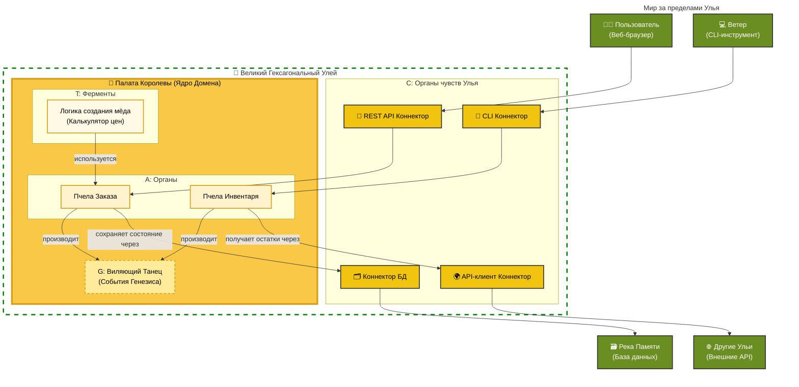
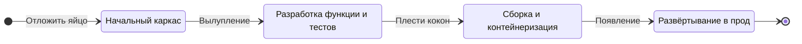
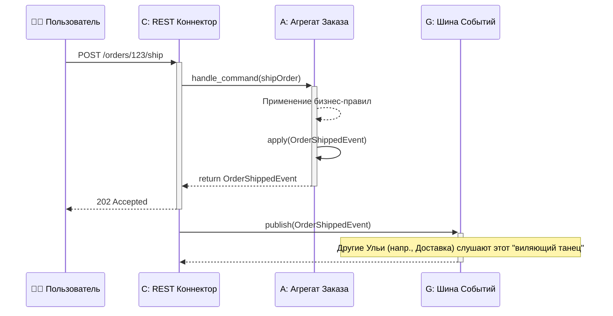

# Сказание о Волшебной Пасеке: Басня о Коде и Мёде

В некотором царстве, в некотором цифровом государстве, жила-была гильдия строителей. Но строили они не замки и мосты, а сложные, невидимые структуры из чистой логики. Это были архитекторы и разработчики программного обеспечения, и их величайшей задачей было создание систем, которые могли бы расти и адаптироваться, не рассыпаясь в хаос.

Они трудились день и ночь, используя всевозможные чертежи и заклинания, но их творения часто превращались в запутанные клубки — хрупкие и трудные для изменения. Они мечтали о способе создавать программное обеспечение, которое было бы таким же устойчивым, организованным и полным жизни, как шумный пчелиный улей.

Однажды мудрая старая архитектор, известная лишь как Пасечница, собрала молодых строителей. «Вы стремитесь создавать великие вещи, — сказала она голосом, тёплым, как летний мёд. — Но вы строите из камня и железа, тогда как должны строить из самой жизни. Посмотрите на пчёл. Их ульи — шедевры дизайна, построенные на века. Давайте же узнаем их секреты».

Так начинается наше сказание. История не только о коде, но и о вечных законах природы, которые могут помочь нам создавать лучшее и более красивое программное обеспечение. Мы отправимся в самое сердце Гексагонального Улья, раскроем его секретный генетический код и научимся растить наших собственных «рабочих пчёл», которые будут верой и правдой служить нашему цифровому королевству.

---

## Сердце Улья: Защищённое Королевство

«Первый секрет пчёл, — начала Пасечница, — это их дом. Улей — это крепость, идеальный шестиугольник. В самом его центре лежит самое драгоценное сокровище: мёд и маточный расплод. Это **Ядро Домена**, где решается жизнь и будущее улья. Оно содержит чистую, неизменную бизнес-логику вашего приложения».

«Вокруг этого ядра пчёлы строят защитные слои из восковых сот. Это **Адаптеры**. Они — единственная связь улья с внешним миром. Некоторые адаптеры, **Первичные Адаптеры**, подобны входу в улей и позволяют дружественным пчёлам (например, пользователям или другим приложениям) входить и делать запросы. Другие, **Вторичные Адаптеры**, подобны пчёлам-сборщицам, которые вылетают, чтобы собрать нектар с цветов (внешних баз данных, API или сервисов)».

«Волшебство этой конструкции, — прошептала она, — в том, что вы можете изменить сад, цветы или даже форму входа, но драгоценное медовое ядро останется нетронутым и в безопасности. Таков путь **Гексагонального Улья**».

---

## Путешествие Пчелы: Сказание о Запросе

Прежде чем мы изучим секретный генетический код, из которого состоит каждая пчела, давайте проследим за путешествием одной рабочей особи. Это путь, который запрос проходит из внешнего мира в самое сердце улья и обратно, демонстрируя нашу архитектуру в действии.

```mermaid
graph TD
    subgraph "Путешествие Пчелы: От Запроса до Ответа"
        direction TB

        A[<div style='font-size: 24px;'>🚶</div><br/><b>Рождение Запроса</b><br/>(Действие из внешнего мира)]
        A --> B{Врата Улья<br/>(Первичный Адаптер / Коннектор)}

        B -- "1. Запрос входит в улей" --> C(🐝<br/>Данные проверяются и преобразуются в известную команду)

        C -- "2. Команда отправляется вглубь" --> D[Предбанник<br/>(Сервис Приложения)]

        D -- "3. Ядро приводится в действие" --> E((👑<br/><b>Палата Королевы</b><br/>Вызов команды Агрегата Домена))

        subgraph "Выполнение Логики Домена"
            E -- "4. Применяются бизнес-правила" --> E
        end

        E -- "5. Результат сохраняется" --> F{Медовые Соты<br/>(Адаптер Постоянства)}

        F --> G[<div style='font-size: 24px;'>🗃️</div><br/>Река Памяти<br/>(База данных)]

        E -- "6. Исполняется 'Виляющий Танец'" --> H((<div style='font-size: 24px;'>📣</div><br/><b>Публикуется Событие Генезиса</b><br/>Уведомляя остальную часть улья))
    end

    classDef external fill:#6B8E23,stroke:#333,stroke-width:2px,color:white;
    classDef adapter fill:#f1c40f,stroke:#333,stroke-width:2px,color:black;
    classDef service fill:#fff9e6,stroke:#d4a017,stroke-width:2px,color:black;
    classDef domain fill:#f9c846,stroke:#d4a017,stroke-width:4px,color:black;
    classDef event fill:#ffeb99,stroke:#d4a017,stroke-width:2px,stroke-dasharray: 5 5,color:black;

    class A,G external;
    class B,F adapter;
    class C,D service;
    class E domain;
    class H event;
    class DomainLogic fill:none,stroke:#d4a017,stroke-dasharray: 2 2
```

## Секретный Генетический Код: Четыре Примитива Жизни

«Но как создаются сами пчёлы?» — спросил молодой строитель.

Пасечница улыбнулась. «Ага, это самый глубокий секрет из всех. Каждое живое существо в улье создано из секретного, четырёхчастного генетического кода. Этот код — источник истины, сама суть жизни. Мы называем его **ATCG**».

«Этот код состоит из четырёх примитивов»:

### A — это Агрегат (Aggregate)

«**Агрегат** подобен жизненно важному органу пчелы — её сердцу или крыльям. Это совокупность крошечных частей, которые работают вместе как единое целое. Вы не говорите части крыла взмахнуть; вы говорите пчеле лететь! Агрегат — хозяин своего маленького мира, следящий за соблюдением всех своих внутренних правил. Это фундаментальная единица согласованности».

### T — это Трансформация (Transformation)

«**Трансформация** подобна волшебному ферменту. Это чистый процесс без состояния, который помогает пчеле выполнять свою работу. Представьте фермент, который превращает нектар в мёд. Сам фермент не меняется, он просто выполняет свою одну, идеальную задачу. Трансформации содержат бизнес-логику, которая не принадлежит ни одному конкретному органу».

### C — это Коннектор (Connector)

«**Коннектор** — это органы чувств пчелы: её антенны, которые чуют запах цветов, или её глаза, которые видят солнце. Это мост между внутренним миром пчелы и садом снаружи. Коннекторы — это переводчики, превращающие язык внешнего мира (например, HTTP-запросы или запросы к базе данных) в сигналы, понятные органам пчелы».

### G — это Событие Генезиса (Genesis Event)

«**Событие Генезиса** — это знаменитый 'виляющий танец' пчелы. Это сообщение, транслируемое всему улью, о том, что произошло нечто важное: 'Я нашла поле с восхитительными цветами!' или 'Заказ был размещён!'. Это непреложный факт, частичка истории, на которую могут реагировать другие пчёлы, позволяя улью работать сообща, не будучи жёстко связанными».

## Маточное Молочко (Royal Jelly Framework)

«Наконец, — сказала Пасечница, — каждая Пчелиная Королева, мать целого домена, рождается из одного и того же волшебного вещества: **Маточного Молочка**».

«В нашем мире это крошечный, мощный внутренний фреймворк. Он сам не выполняет никакой бизнес-логики, но предоставляет необходимые питательные вещества — базовые классы, интерфейсы, саму суть того, чтобы быть `Агрегатом` или `Событием Генезиса`. Каждое ядро домена в вашем королевстве построено на этой общей, священной основе, гарантируя, что все они говорят на одном языке и следуют одним и тем же божественным законам».

---

## Карта Пасеки: Портрет Улья

«Чтобы по-настояшему понять, — сказала Пасечница, доставая старую, зачарованную карту, — вы должны увидеть улей целиком».

На карте была изображена живая, дышащая система. Наверху был **Сад**, мир за пределами улья с его пользователями, базами данных и другими системами. Ниже лежал сам **Великий Гексагональный Улей**. Внешний слой состоял из **Коннекторов (C)**, органов чувств, охранявших улей. А в самом центре находилась **Палата Королевы**, ядро домена, где обитали жизненно важные **Агрегаты (A)** и **Трансформации (T)**, и где рождались **События Генезиса (G)**.

«Смотрите, — сказала она. — Полная картина нашей архитектуры. Система, спроектированная самой природой».



---

## Метаморфоза: Рождение Рабочей Пчелы

«Но как появляется на свет новая пчела — новая функция?» — спросил молодой строитель с любопытством в глазах.

Пасечница улыбнулась. «Новую пчелу не просто строят. Она рождается. Она проходит метаморфозу, священный путь роста».

Она объяснила, что каждая новая функция, каждая новая рабочая пчела, проходит один и тот же четырёхэтапный жизненный цикл:

1. **Яйцо (Инициализация):** Создаётся новая, пустая ячейка соты. Это начальная структура файлов, каркас для нашей новой пчелы. В ней нет ничего, кроме обещания.
2. **Личинка (Разработка):** Яйцо вылупляется! Личинку кормят Маточным Молочком (основным фреймворком) и пчелиным хлебом (бизнес-логикой). Здесь пишется код, создаются тесты, и пчела начинает обретать форму, а её код ATCG определяет её предназначение.
3. **Куколка (Трансформация):** Личинка плетёт кокон. Это этап сборки и контейнеризации. Код компилируется, зависимости фиксируются, и он упаковывается в развёртываемую единицу — образ Docker, безопасный и готовый к миру.
4. **Взрослая особь (Развёртывание):** Пчела появляется, полностью сформированная! Её выпускают в улей для выполнения своих обязанностей. Функция развёртывается в производственную среду, становясь живой, дышащей частью системы.

«Этот жизненный цикл гарантирует, что каждая пчела, независимо от её функции, рождается сильной, протестированной и готовой содействовать процветанию улья», — заключила Пасечница.

Вот жизненный цикл в виде простой диаграммы:



---

## Мораль Сей Басни

И так строители узнали секреты волшебной пасеки. Они поняли, что, обращаясь к природе, они могут создавать программное обеспечение, которое является не жёсткой, безжизненной машиной, а живой, адаптируемой экосистемой.

Гексагональный Улей учит нас защищать нашу основную логику. Генетический код ATCG даёт нам общий язык для строительства. А жизненный цикл пчелы даёт нам предсказуемый путь для роста. Применяя эти паттерны, мы тоже можем строить цифровые королевства, которые будут устойчивыми, поддерживаемыми и по-настоящему полными жизни. Ведь в конце концов, лучший код не просто пишется; он выращивается.

---

## Для Любознательных Умов: Технический Гримуар Пасечницы

_Этот раздел отходит от нашей сказки, чтобы представить более технический взгляд на обсуждаемые нами паттерны._

### Примитивы ATCG в псевдокоде

Вот концептуальный взгляд на то, как могут быть реализованы наши примитивы. Для ясности мы будем использовать синтаксис, подобный TypeScript.

#### A: Агрегат

`Агрегат` инкапсулирует состояние и обеспечивает соблюдение собственных правил (инвариантов).

```typescript
// Состояние нашего Заказа
interface OrderState {
  id: string;
  items: string[];
  status: "placed" | "shipped" | "cancelled";
}

class OrderAggregate {
  private state: OrderState;

  constructor(initialState: OrderState) {
    this.state = initialState;
  }

  // Публичный обработчик команд: единственный способ изменить агрегат
  public shipOrder(command: { shippingId: string }): GenesisEvent {
    if (this.state.status !== "placed") {
      throw new Error("Нельзя отправить заказ, который не был размещён.");
    }

    // Состояние изменяется путём применения события
    const event = new OrderShippedEvent({
      orderId: this.state.id,
      shippingId: command.shippingId,
      timestamp: new Date(),
    });

    this.apply(event);

    return event;
  }

  // Внутреннее изменение состояния
  private apply(event: OrderShippedEvent): void {
    this.state.status = "shipped";
  }
}
```

#### C: Коннектор

`Коннектор` преобразует внешний ввод в команды домена.

```typescript
// Управляющий коннектор для REST API
class RestConnector {
  private orderService: OrderService; // Сервис, который находит и использует агрегаты

  public startServer(): void {
    // Псевдокод для веб-сервера
    WebApp.post("/orders/:id/ship", (req, res) => {
      try {
        const orderId = req.params.id;
        const shippingId = req.body.shippingId;

        // Задача коннектора — преобразовать HTTP в команду домена
        this.orderService.ship(orderId, shippingId);

        res.status(202).send({ message: "Заказ отправляется." });
      } catch (error) {
        res.status(400).send({ error: error.message });
      }
    });
  }
}
```

### "Протокол Пыльцы": Заметка о междоульевом общении

**Протокол Пыльцы** — это простая и мощная идея: так же, как цветы имеют предсказуемую структуру, понятную пчёлам, наши `События Генезиса` должны иметь предсказуемую структуру, чтобы другие сервисы (Ульи) могли их понимать.

Событие, совместимое с Протоколом Пыльцы, всегда должно содержать:

- `eventId`: Уникальный идентификатор для этого конкретного экземпляра события.
- `eventType`: Чёткое имя в прошедшем времени (например, `OrderShipped`).
- `eventVersion`: Номер версии (`1.0`, `2.1`) для управления эволюцией схемы.
- `timestamp`: Время, когда произошло событие.
- `aggregateId`: Идентификатор агрегата, который произвёл событие.
- `payload`: Данные, специфичные для этого события.

Применяя этот простой контракт, мы создаём здоровую экосистему, где новые сервисы могут легко потреблять события от существующих, не создавая жёсткой связи.

И последняя мысль по этой метафоре: если Протокол Пыльцы определяет _гены_ (структуру события), то сырые, сериализованные данные, которые передаются по сети — строка JSON, байты Protobuf — это и есть сама _генетическая последовательность_. Это `tataaaaataaaataaaaaa...` нашей системы, физическое выражение логического гена.

### Диаграмма последовательности: От запроса до виляющего танца

Эта диаграмма показывает полный поток: запрос пользователя поступает через `Коннектор`, обрабатывается `Агрегатом`, который производит `Событие Генезиса`, публикуемое для потребления другими частями системы.



### Великое Видение Пасечницы: Самосоздающиеся Системы

Последний, самый глубокий секрет улья таков: если архитектура достаточно чиста, система может начать строить себя сама. Сопоставление "Метаморфоза -> ATCG" — это не просто метафора для ручного процесса; это план для автоматизации.

Представьте себе разработчика, который хочет создать новую «пчелу» (функцию). Вместо того чтобы писать шаблонный код, он просто создаёт декларативное определение, возможно, в файле YAML, указывая требуемые примитивы ATCG:

```yaml
# Декларативное определение для новой функции "ShippingNotification"
kind: WorkerBee
name: ShippingNotifier
description: "Пчела, которая отправляет уведомление при отгрузке заказа."

listens_to: # События Генезиса, на которые реагирует эта пчела
  - eventType: OrderShipped
    eventVersion: 1.0

produces: # Новые События Генезиса, которые может создавать эта пчела
  - eventType: NotificationSent
    eventVersion: 1.0

# Коннекторы, необходимые для взаимодействия с внешним миром
connectors:
  - name: email_service
    type: driven # Эта пчела управляет внешним сервисом
    port: SmtpPort
```

Автоматизированная система **«Пчелиная Королева»** — сложный оператор CI/CD — читает это определение и организует всю Метаморфозу:

- **Яйцо:** Она получает YAML и генерирует начальный каркас проекта, создавая все необходимые файлы из шаблонов.
- **Личинка:** Она берёт основную бизнес-логику, написанную разработчиком (единственная часть, требующая человеческого творчества), и внедряет её в сгенерированный код. Затем она запускает набор автоматизированных тестов для нового компонента.
- **Куколка:** После успешного тестирования она упаковывает компонент в защищённый, готовый к развёртыванию контейнер.
- **Взрослая особь:** Она развёртывает этот новый контейнер в производственную среду, где он оживает и начинает слушать указанные события.

Это конечная цель: архитектура, настолько хорошо определённая, что она становится живой фабрикой для своих собственных компонентов. Это слияние Domain-Driven Design, GitOps и Model-Driven Development, создающее систему, которая не просто построена, а по-настоящему _выращена_.

### Продвинутое Пчеловодство: Сбор Ресурсов, Времена Года и Защита

По мере взросления улей разрабатывает более сложные стратегии взаимодействия с миром, управления собственным ростом и защиты.

#### Паттерны Сбора Ресурсов (Паттерны Устойчивости и Кэширования)

Выживание улья зависит от того, насколько эффективно он собирает ресурсы из внешнего мира (внешних сервисов).

- **Паттерн "Пчела-разведчица" (Автоматический выключатель):** Прежде чем отправить сотни сборщиц на новое поле цветов (внешний API), улей сначала отправляет нескольких разведчиц. Если разведчицы сталкиваются с опасностью или не находят нектара (API не работает или медленный), они возвращаются и сигнализируют, что не стоит тратить ресурсы на это поле в течение некоторого времени. Это предотвращает каскадный сбой во всем улье из-за неработающего внешнего сервиса.
- **Паттерн "Нектарный Запас" (Кэширование):** Для часто посещаемых цветов пчёлы не всегда летят обратно в главный улей. Они могут хранить нектар в небольших, более близких сотах для быстрого доступа. Точно так же наши приложения должны кэшировать часто запрашиваемые данные из внешних сервисов для уменьшения задержек и нагрузки.

#### Времена Года в Улье (Жизненный цикл системы)

Программная система, как и улей, имеет времена года, которые диктуют её основную деятельность.

- **Весна (Рост):** Время бурного роста. Королева откладывает много яиц, и постоянно рождаются новые пчёлы (функции). Основное внимание уделяется быстрому развитию и расширению.
- **Лето (Зрелость):** Улей находится на пике производительности. Фокус смещается со строительства новых сот на производство как можно большего количества мёда (бизнес-ценности). Система стабильна, и работа сосредоточена на оптимизации и производительности.
- **Осень (Рефакторинг и Устаревание):** Улей готовится к зиме. Старые, неиспользуемые соты очищаются, а ресурсы консолидируются. Это время для погашения технического долга, рефакторинга сложных областей и вывода из эксплуатации старых функций, которые больше не приносят пользы.
- **Зима (Поддержка):** Период затишья. Активность улья замедляется, сосредотачиваясь только на выживании и необходимом обслуживании. Для программного обеспечения это может быть период заморозки кода, когда работа ограничивается критическими исправлениями безопасности и поддержанием стабильности системы.

#### Вредители и Хищники (Паттерны Безопасности)

Богатый улей — это цель. Он должен защищаться от угроз.

- **Пчёлы-охранницы (Аутентификация и Авторизация):** Не каждый может войти в улей. Пчёлы-охранницы у входа проверяют каждого посетителя, проверяя его уникальный запах, чтобы убедиться, что он свой. Это наш слой аутентификации и авторизации, гарантирующий, что только действительные пользователи и сервисы могут получить доступ к системе.
- **Прополис (Валидация и Санитизация Входных Данных):** Пчёлы используют липкое, антимикробное вещество под названием прополис, чтобы заделать каждую щель и трещину, предотвращая проникновение болезней. Это наша строгая валидация входных данных. Мы должны рассматривать все данные из внешнего мира как потенциально вредные, очищая и проверяя их, прежде чем они достигнут нашего ядра домена.
