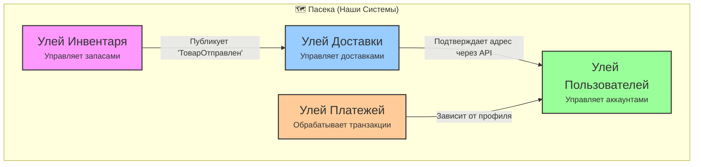
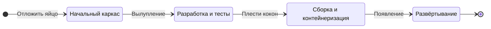

# Сказание о Волшебной Пасеке

В некотором царстве, в некотором цифровом государстве, жила-была гильдия строителей. Но строили они не замки и мосты, а сложные, невидимые структуры из чистой логики. Это были архитекторы и разработчики программного обеспечения, и их величайшей задачей было создание систем, которые могли бы расти и адаптироваться, не рассыпаясь в хаос.

Они мечтали о способе создавать программное обеспечение, которое было бы таким же устойчивым, организованным и полным жизни, как шумный пчелиный улей.

Однажды мудрая старая архитектор, известная лишь как Пасечница, собрала молодых строителей. «Вы стремитесь создавать великие вещи, — сказала она голосом, тёплым, как летний мёд. — Но вы строите из камня и железа, тогда как должны строить из самой жизни. Посмотрите на пчёл. Их ульи — шедевры дизайна. Давайте же узнаем их секреты».

И вот, Пасечница открыла тяжёлую, обтянутую кожей книгу. «Это, — сказала она, — Гримуар. Он описывает вселенную Улья на каждом уровне, от величайшего размаха космоса до мельчайшего танца частицы. Чтобы стать мастером-строителем, вы должны видеть эту вселенную на всех семи уровнях реальности».

---

# Гримуар Пасечницы: Семь Уровней Улья

### Уровень 1: Организм
«Во-первых, — начала Пасечница, — вы должны смотреть глазами бога и видеть весь **Организм**. Это всё наше цифровое королевство, совокупность всех наших Ульев, работающих в согласии. Его здоровье — наша конечная цель».

### Уровень 2: Клетка
«Далее, вы должны смотреть глазами биолога и сосредоточиться на одной **Клетке**. Это один Ограниченный Контекст, один сервис. Он определяется своей прочной, защитной Клеточной Стенкой — своим API. Он автономен и является хозяином своего маленького мира».

Карта Пасеки показывает множество таких Клеток, которые общаются и сотрудничают, чтобы сформировать Организм:


### Уровень 3: Архитектурные 'Кодоны'
«Теперь вы должны смотреть глазами генетика и понимать 'слова', которые наделяют Клетку её функцией. Это три основных **Кодона**, фундаментальных паттерна действия. Каждая задача, выполняемая Клеткой, является выражением одного из них»:

*   **Кодон "Обработать Команду" (`C -> A -> G`):** Слово, означающее 'изменить'.
    ```mermaid
    graph LR; C[C: Коннектор] --> A[A: Агрегат] --> G[G: Событие];
    style C fill:#f1c40f,stroke:#333,stroke-width:2px; style A fill:#fff3cd,stroke:#d4a017,stroke-width:2px; style G fill:#ffeb99,stroke:#d4a017,stroke-width:2px,stroke-dasharray: 5 5;
    ```
*   **Кодон "Запросить Данные" (`C -> T -> C`):** Слово, означающее 'увидеть'.
    ```mermaid
    graph LR; C_In[C: Вход] --> T[T: Трансформация] --> C_Out[C: Выход];
    style C_In fill:#f1c40f,stroke:#333,stroke-width:2px; style T fill:#fff9e6,stroke:#d4a017,stroke-width:2px; style C_Out fill:#f1c40f,stroke:#333,stroke-width:2px;
    ```
*   **Кодон "Реагировать на Событие" (`G -> C -> A -> G`):** Слово, означающее 'слушать'.
    ```mermaid
    graph LR; G_In[G: Вход] --> C[C: Слушатель] --> A[A: Агрегат] --> G_Out[G: Выход];
    style G_In fill:#ffeb99,stroke:#d4a017,stroke-width:2px,stroke-dasharray: 5 5; style C fill:#f1c40f,stroke:#333,stroke-width:2px; style A fill:#fff3cd,stroke:#d4a017,stroke-width:2px; style G_Out fill:#ffeb99,stroke:#d4a017,stroke-width:2px,stroke-dasharray: 5 5;
    ```

### Уровень 4: Примитивы ATCG
«Ещё глубже, вы должны смотреть глазами химика. Кодоны — это 'слова', но они составлены из алфавита из четырёх букв: наших **Примитивов ATCG**.
*   **A**грегат: Орган.
*   **T**рансформация: Фермент.
*   **C**коннектор: Чувство.
*   **G**енезис-Событие: Виляющий танец.
Каждый паттерн в нашем Улье — это уникальная последовательность этих четырёх букв».

> *[Примечание: В HTML-версии этой статьи здесь находится специальная анимация, визуализирующая генезис компонента из четырёх примитивов ATCG.]*

### Уровень 5: 'Кодоны' как Реализация
«Теперь вы должны смотреть глазами писца, с чернилами на пальцах. Здесь магия становится реальностью. Примитивы ATCG строятся путём композиции маленьких, чистых, тестируемых функций — отдельных `Кодонов` нашего кода. Это уровень реализации, управляемый принципами чистоты и ясности».

Чтобы завершить биологическую метафору: если скрипт `genesis_engine/main.py` — это **Рибосома** (фабрика), а маленькие функции в `genesis_engine/src/` — это **Аминокислоты** (строительные блоки), то файлы в нашей директории `tRNA/` — это **молекулы тРНК**. Каждый шаблон — это специализированная молекула тРНК, которая читает определённый архитектурный Кодон и доставляет соответствующий структурный "каркас", на который затем нанизываются конкретные детали. Это последнее, решающее звено между генетическим кодом и живым белком.

Этот процесс реализации и есть **Метаморфоза**: жизненный цикл одной функции, от идеи до живой части улья.


### Уровень 6: Физика
«Наконец, — прошептала Пасечница, — вы должны смотреть глазами физика и понимать саму ткань реальности, в которой существует наш Улей. Это **Среда**: операционная система, сеть, процессор. Этот уровень управляет всеми остальными. Мы не контролируем законы этой физики, но мы должны их уважать».

### Уровень 7: Намерение
«Есть и последний уровень, — сказала она, почти шёпотом. — Он не является частью Улья, но он повсюду. Это 'почему' для каждого 'что'. Это **Намерение**».

«Это цель, ради которой существует весь Организм. Это не техническая, а философская проблема. Это миссия. Без неё Улей — просто структура, скопление клеток без души. Но с Намерением он становится живым существом».

«Увидьте эти семь уровней, — заключила она, закрывая Гримуар, — и вы будете не просто строителем. Вы будете Пасечником».

---

## Артефакты Гримуара

Наш Гримуар — это не просто книга философии; он содержит осязаемые артефакты, которые воплощают эти идеи в жизнь.

### Протокол Пыльцы (`pollen.proto`)
Чтобы все наши Ульи могли говорить друг с другом, у нас есть формальный контракт для наших Событий Генезиса, определённый с помощью Protocol Buffers. Он гарантирует, что каждый "виляющий танец" имеет согласованную структуру.

### Движок Генезиса (`genesis-engine/`)
Для ускорения создания новых "пчёл" в соответствии с нашими архитектурными паттернами у нас есть инструмент командной строки. `genesis-engine` — это сам по себе Улей, построенный по собственным принципам. Он содержит:
*   **`hive-cli`**: Главная точка входа, или "Клеточная Мембрана".
*   **`engine/`**: "Органеллы", содержащие логику для команд, конфигурации и вспомогательных функций.

Этот инструмент позволяет разработчику "выводить" шаблон для новой функции одной командой:
`./genesis-engine/hive-cli hatch command МояНоваяФункция`

### Компилятор Mermaid (`genesis_engine/main.py`)
Величайшее заклинание в Гримуаре. Это реализация самого Движка Генезиса. Он читает архитектурную диаграмму из файла `.md` и компилирует её в исполняемый код, доказывая, что архитектура может быть использована для создания самой себя. Это высшее доказательство нашей философии: система, которая выращивает сама себя.
