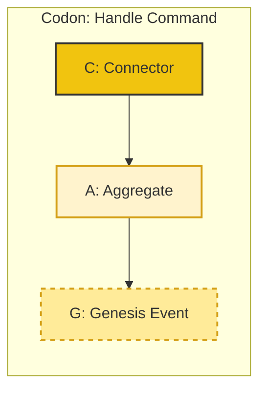
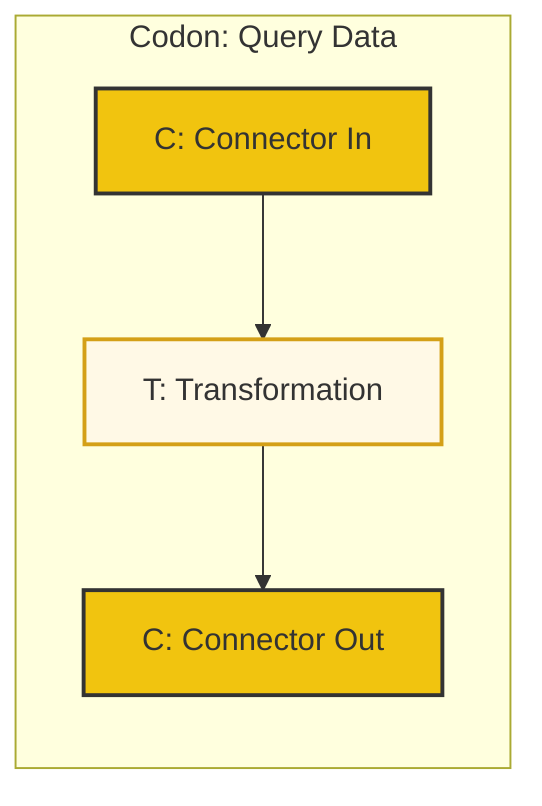
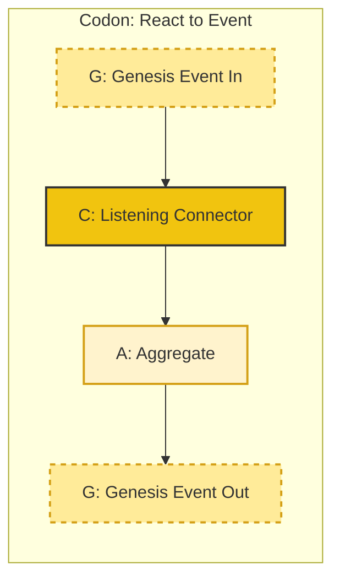

## The Beekeeper's Book of Codons

"The four ATCG primitives are the letters of our alphabet," the Beekeeper continued, opening a heavy, leather-bound book. "But letters alone are not enough. They form 'codons'—words with specific, powerful meanings. These are the fundamental spells of our craft."

"Let us study the three most essential codons."

### 1. The "Handle Command" Codon
"This is the most common spell, the word for 'to do' or 'to change'," she said. "It describes how the outside world can ask our hive to perform an action."

The pattern is simple: An external request arrives at a **Connector (C)**. The Connector translates it into a command and calls an **Aggregate (A)**. The Aggregate enforces its rules, changes its state, and emits a **Genesis Event (G)** to announce what has happened.

### 2. The "Query Data" Codon
"Sometimes, the world doesn't want to change our hive, but merely to ask a question," the Beekeeper explained. "For this, we use the 'Query Data' codon, the word for 'to see' or 'to know'."

This pattern is for reading data. A request enters through a **Connector (C)**. It is passed to a stateless **Transformation (T)**, which gathers the necessary information (perhaps from one or more read-optimized stores) and transforms it into a data transfer object (DTO) to be sent back to the outside world. No state is changed; no Genesis Events are created.

### 3. The "React to Event" Codon
"The final spell is the most magical," she whispered. "It is how different parts of the hive, or even different hives in the apiary, talk to each other. It is the word for 'to listen' and 'to react'."

This pattern begins with a listening **Connector (C)**, like a bee's ear tuned to the frequency of a specific "waggle dance" (a Genesis Event from another domain). When it hears the event, it translates it into a command and, just like the "Handle Command" codon, calls an **Aggregate (A)** in its own domain. This might cause a chain reaction, where the second aggregate produces its own **Genesis Event (G)**.

