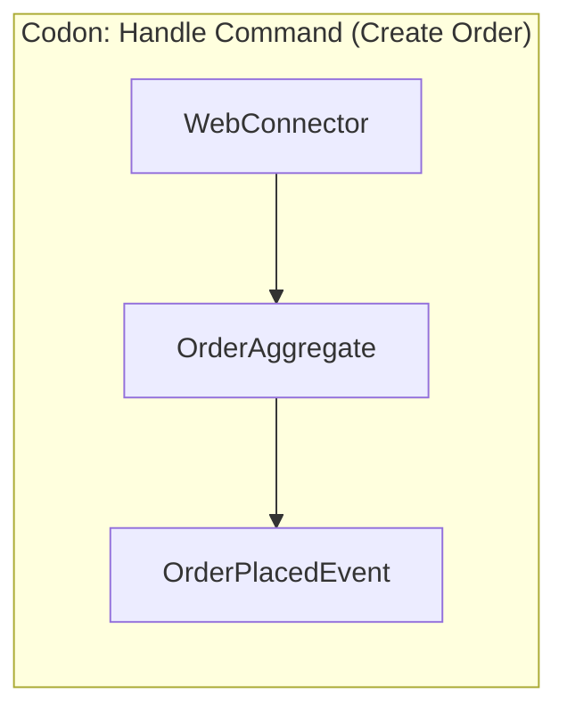

# Compiler Source: Create a New Order

This file contains the declarative source code for a "Create Order" feature, defined as a Mermaid diagram. The `mermaid_compiler.py` script will parse this file to generate the runtime code.

The data contracts for each component are encoded in the `style` definitions below:
- `fill`: Maps to the name of the primary data class used by the component (e.g., a Command, State, or Event Payload).
- `stroke`: Maps to the name of the primary identifier for the resource (e.g., `order_id`).

