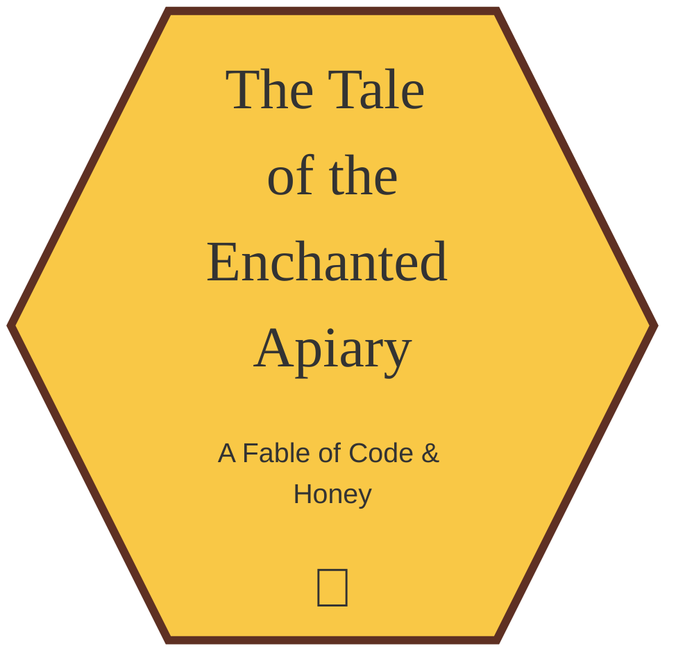

```mermaid
graph LR
    A{{"<div style='padding:20px; font-size: 42px; font-family: Patrick Hand, cursive; color: #2c1810;'>The Tale of the<br/>Enchanted Apiary</div><div style='font-family: Montserrat, sans-serif; font-size:20px; color: #5e3023; margin-top:10px;'>A Fable of Code & Honey</div><br><div style='font-size: 40px;'>🐝</div>"}}

    style A fill:#f9c846,stroke:#5e3023,stroke-width:6px
```

**Note to user:** You can render this Mermaid code into an SVG using various online tools or command-line utilities. For example, using the Mermaid CLI: `mmdc -i cover.md -o cover.svg`.
