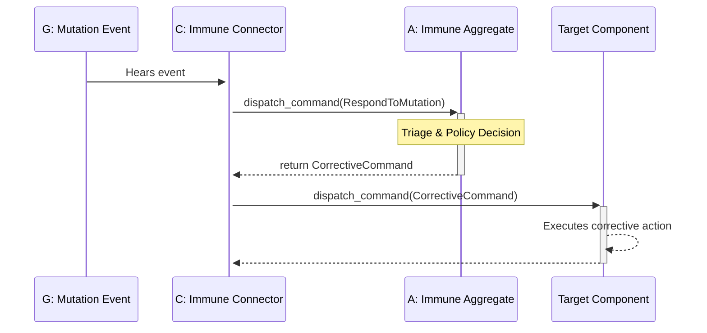

# The Hive Immune System: A Framework for Resilience

"A Hive is a living thing," the Beekeeper taught, her voice low and serious. "And like all living things, it is not perfect. It exists in a world of chaos. Sometimes, a bee is born with a faulty wing. Sometimes, a sickness enters the gates. A Hive that cannot heal itself is a Hive that is already dying."

"Therefore," she continued, "the most profound wisdom is not in building a *perfect* Hive, but in building a Hive that *knows how to handle imperfection*. We must bestow upon it an **Immune System**."

## The Concept of Architectural Immunity

The Hive Immune System is not a single component, but an architectural layer dedicated to resilience, error handling, and adaptive response. Its purpose is to protect the health of the entire Organism by detecting and neutralizing "mutations"—events that threaten the stability of a Cell or the integrity of the Hive's logic.

The system operates on a simple, powerful principle:
**Every significant failure within the Hive must be announced as a formal Mutation Event.**

These events are not mere logs; they are cries for help, broadcast into the Hive's nervous system (the event bus). Specialized "immune cells" listen for these cries and orchestrate a response.

## The Immune Cells

The Immune System is composed of specialized Cells, each with a unique role in protecting the Hive:

- **Sentinel Cells:** These are simple, passive listeners. Their only job is to detect specific Mutation Events and re-broadcast them with additional context, or perhaps to simply record them in a "Book of Maladies" for later analysis by the Beekeeper.
- **Phage Cells:** These are the first responders. They are designed to handle specific, known "infections" (transient errors). A Phage cell might implement an "Immune Response" codon that attempts to retry a failed operation with an exponential backoff, or to reroute a request to a healthy replica of a Cell.
- **Macrophage Cells:** These are the heavy-duty cleaners. They handle chronic or catastrophic mutations. If a Cell is throwing off a stream of unrecoverable errors, a Macrophage may be dispatched to "devour" it—to quarantine the Cell by shutting down its Connectors, preventing it from causing further harm to the Organism. In the most extreme cases, it may trigger "apoptosis," a graceful, managed shutdown and removal of the entire Cell.

By formalizing our approach to failure, we turn errors from a source of chaos into a source of strength. We create a Hive that doesn't just survive, but learns, adapts, and endures.

---

## A Taxonomy of Mutations

"Not all sickness is the same," the Beekeeper explained, pointing to a chart of ailing bees. "We must learn to distinguish a simple cold from a true plague. So too must our Immune System learn to distinguish different types of mutations."

A **Mutation Event** is a specialized type of Genesis Event, one that describes a failure. To allow for a nuanced immune response, we must classify them. All Mutation Events should carry a payload that includes the original error, the context in which it occurred, and the ID of the component that failed.

Here is a proposed taxonomy:

### 1. `ConfigurationDefect` (Genetic Flaw)
- **Description:** This mutation represents an error in the static configuration of a Cell or component. It is a "birth defect."
- **Examples:**
  - A required environment variable is missing.
  - A YAML file has a syntax error (a "typo").
  - A connector is configured with an invalid address for an external service.
- **Immune Response:** These are typically non-recoverable without Beekeeper intervention. The appropriate response is usually to prevent the Cell from starting, log the precise error, and trigger an alert. A Macrophage cell might be tasked with ensuring the defective cell is fully quarantined.

### 2. `TransientInfection` (Common Cold)
- **Description:** This represents a temporary, often external, failure. The operation might succeed if retried.
- **Examples:**
  - A network request times out.
  - A database connection is temporarily lost.
  - A third-party API returns a `503 Service Unavailable` error.
- **Immune Response:** This is the primary domain of the **Phage Cells**. The typical response is a retry mechanism, often with an exponential backoff strategy to avoid overwhelming the external service. If retries fail after a certain threshold, the `TransientInfection` may be escalated to a `ChronicFailure`.

### 3. `ChronicFailure` (Serious Illness)
- **Description:** This mutation represents a persistent failure that is not resolved by retries. It indicates a deeper problem with a component or one of its dependencies.
- **Examples:**
  - A third-party API consistently returns `401 Unauthorized`, indicating a permanent authentication issue.
  - A database query fails repeatedly due to a malformed query (a bug in the code).
  - A Cell runs out of memory and is terminated by the orchestrator.
- **Immune Response:** This requires a more serious intervention, often by a **Macrophage Cell**. The response could be to trigger a circuit breaker, rerouting traffic away from the failing component. It might involve logging detailed diagnostics and alerting the Beekeeper. In severe cases, it could lead to the apoptosis of the responsible Cell.

### 4. `InvariantViolation` (Autoimmune Disorder)
- **Description:** This is a special, severe type of mutation where a Cell violates its own internal consistency rules. The Aggregate's invariants have been breached. This is an internal contradiction, a form of self-sickness.
- **Examples:**
  - An `Order` aggregate finds itself in a state where the order total does not match the sum of its line items.
  - An `Inventory` aggregate discovers a negative stock level.
- **Immune Response:** This is the most critical type of mutation. It indicates a serious bug in the domain logic. The response must be swift and decisive, almost always handled by a **Macrophage**. The primary goal is to prevent the corrupted state from spreading. This usually involves immediate quarantine of the aggregate instance, logging a critical alert, and potentially halting all operations for that specific entity until a Beekeeper can intervene.

---

## The "Immune Response" Codon

"An Immune System that can only see sickness but cannot act is no system at all," the Beekeeper stated firmly. "The final piece of this wisdom is the 'Immune Response' itself—the spell for healing and protection."

The **Immune Response Codon** is a specialized architectural pattern used by the immune cells (like Phages and Macrophages) to act upon a detected mutation. It is a formal sequence of steps for receiving a threat, deciding on a course of action, and dispatching a corrective command.

The pattern's flow is as follows:

1.  **Detection:** A **Mutation Event** (`G_mut`) is broadcast on the event bus.
2.  **Reception:** A listening **Connector (`C`)** on an immune cell, subscribed to this type of mutation, receives the event.
3.  **Triage & Decision:** The Connector translates the event into a command (e.g., `RespondToMutation`) and sends it to the cell's **Aggregate (`A_immune`)**. This specialized aggregate contains the "policy" logic. It assesses the severity and nature of the mutation and decides on the appropriate corrective action.
4.  **Action:** The aggregate then issues a new **Corrective Command** (`Cmd_corrective`), which is sent to the target component that needs to be acted upon (e.g., a command to a Cell's connector to shut itself down).

This creates a clear, testable, and robust flow for handling failures within the Hive.

