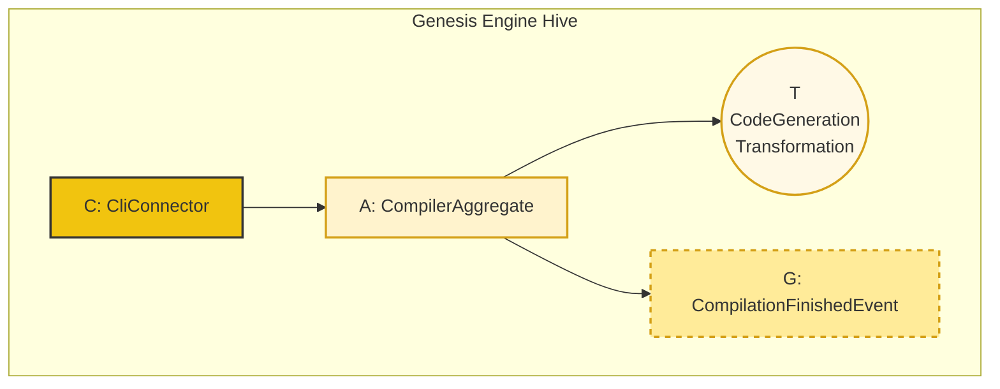

# Architecture of the Genesis Engine

The Genesis Engine (the "Mermaid Compiler") is not just a tool; it is the ultimate expression of the Beekeeper's philosophy. It is a Hive that builds other Hives. As such, it is built using its own architectural primitives.

The entire compilation process is modeled as a single "Handle Command" Codon (`C -> A -> G`).

### The Compiler as a "Handle Command" Codon

### Component Descriptions

1.  **`CliConnector` (C):**
    *   **Responsibility:** To be the interface between the human developer and the Genesis Engine.
    *   **Action:** It parses command-line arguments (e.g., `python main.py source.md output/`) and translates them into a `CompileFromSource` command.

2.  **`CompilerAggregate` (A):**
    *   **Responsibility:** To manage the state of a single compilation job. Its state could be an Abstract Syntax Tree (AST) of the parsed diagram.
    *   **Action:** It receives the `CompileFromSource` command. It reads the source file, parses the Mermaid diagram, and builds its internal state (the AST). It then calls one or more Transformations to generate the code. Finally, it emits a `CompilationFinished` event.

3.  **`CodeGenerationTransformation` (T):**
    *   **Responsibility:** A stateless service that takes the parsed data from the `CompilerAggregate` and the loaded `tRNA` templates.
    *   **Action:** It populates the templates with the parsed data and returns the generated code as a dictionary of `filename: content`.

4.  **`CompilationFinishedEvent` (G):**
    *   **Responsibility:** To announce that the compilation has succeeded.
    *   **Payload:** Could contain metadata like the number of files generated, their paths, and any warnings. In a more advanced system, another `Connector` could listen for this event to, for example, automatically run tests on the newly generated code.

This architecture ensures that our compiler is not a monolithic script, but a clean, maintainable system that "eats its own dog food"—or rather, "is built from its own honey."
