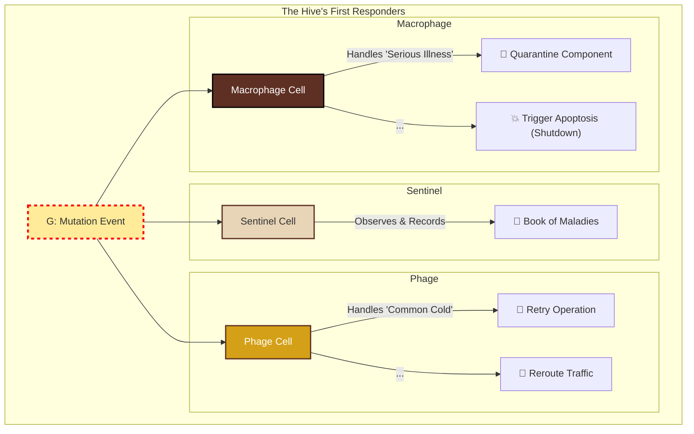

```mermaid
graph TD
    subgraph "The Hive's First Responders"
        G[G: Mutation Event]

        G --> S[Sentinel Cell];
        G --> P[Phage Cell];
        G --> M[Macrophage Cell];

        subgraph Sentinel
            S -- "Observes & Records" --> S_Action["📖 Book of Maladies"];
        end

        subgraph Phage
            P -- "Handles 'Common Cold'" --> P_Action_1["🔄 Retry Operation"];
            P -- "..." --> P_Action_2["🔀 Reroute Traffic"];
        end

        subgraph Macrophage
            M -- "Handles 'Serious Illness'" --> M_Action_1["🛑 Quarantine Component"];
            M -- "..." --> M_Action_2["💥 Trigger Apoptosis (Shutdown)"];
        end
    end

    style G fill:#ffeb99,stroke:red,stroke-width:3px,stroke-dasharray: 5 5
    style S fill:#e8d5b7,stroke:#5e3023,stroke-width:2px
    style P fill:#d4a017,stroke:#5e3023,stroke-width:2px,color:white
    style M fill:#5e3023,stroke:black,stroke-width:2px,color:white
```
