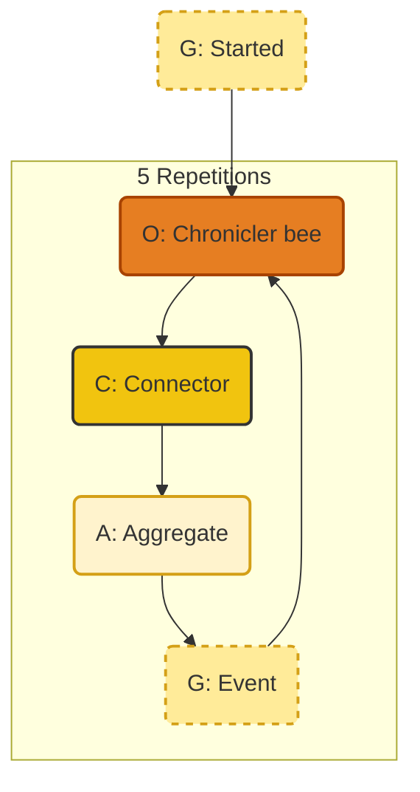

```mermaid
graph TD
    G_Started(G: Started) --> Chronicler(O: Chronicler bee);

    subgraph Quest Cycle [5 Repetitions]
        direction LR
        Chronicler --> Connector(C: Connector);
        Connector --> Aggregate(A: Aggregate);
        Aggregate --> G_Event(G: Event);
        G_Event --> Chronicler;
    end

    style G_Started fill:#ffeb99,stroke:#d4a017,stroke-width:2px,stroke-dasharray: 5 5
    style Chronicler fill:#e67e22,stroke:#a84300,stroke-width:2px
    style Connector fill:#f1c40f,stroke:#333,stroke-width:2px
    style Aggregate fill:#fff3cd,stroke:#d4a017,stroke-width:2px
    style G_Event fill:#ffeb99,stroke:#d4a017,stroke-width:2px,stroke-dasharray: 5 5
```
